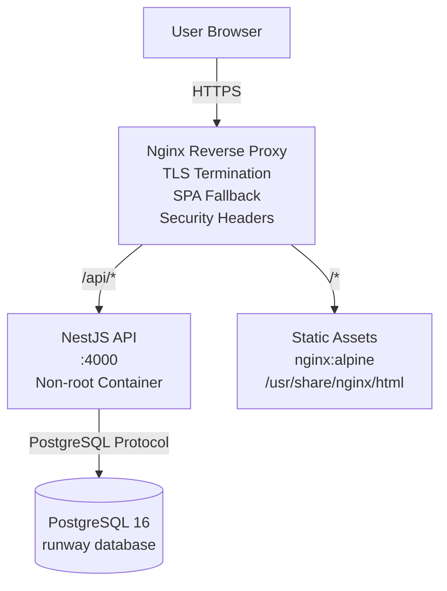

# Runway

An investor-grade metrics dashboard for founders that produces polished PDF investor updates.


## Tech Stack

| Technology | Purpose |
|---|---|
| React 18 + TypeScript + Vite | Frontend SPA framework & build |
| HeroUI + Tailwind | Design system & styling |
| NestJS + TypeScript | Backend API framework |
| Postgres + Prisma | Primary database & ORM |
| JWT (passport-jwt) | Stateless authentication |
| @react-pdf/renderer | PDF investor update generation |
| papaparse | CSV import/export |
| framer-motion | UI animations |
| Recharts | Data visualizations |
| Docker + docker-compose | Containerization & local Postgres |
| TanStack Query | Server state management & caching |
| Jest + Vitest | Unit & e2e testing |

## Deployment Architecture



## Key Capabilities

- Multi-tenant with enforced RBAC (OWNER/ADMIN/ANALYST/VIEWER)
- Real-time MRR, NRR, runway, cohort retention computed server-side
- Polished PDF investor updates via `@react-pdf/renderer`
- CSV import/export with validation
- Cross-persona comparison (demo mode)
- Live session management & device revocation

## Security Model

- Access tokens carry identity only; roles & company resolved per-request from DB
- Refresh tokens: opaque, httpOnly cookie, SHA-256 hashed, rotated on use
- `X-Company-Id` selects from caller's memberships — never grants cross-tenant access
- Real-PostgreSQL test suite catches DB-path authorization bugs

## Modes

| Mode | Use Case | Data Source |
|---|---|---|
| Demo (`ENABLE_DATABASE=false`) | Zero-setup evaluation | Persona-driven fake generator |
| Full (`ENABLE_DATABASE=true`) | Real deployment | PostgreSQL + JWT auth |

## Project Structure

```
├── backend/           # NestJS API (Auth, Companies, Metrics, Cohorts, Reports, Audit)
├── frontend/          # React 18 + Vite + HeroUI + TanStack Query
├── docker-compose.yml # Postgres + API + Web (nginx)
├── deploy/nginx/      # TLS termination, SPA fallback, security headers
└── plan/              # 6-phase productionization roadmap (Phases 1-5 done)
```

## Quick Start

```bash
pnpm install           # installs backend + frontend together
pnpm dev               # starts API (:4000) + web app (:5173) together
```

Demo mode runs by default (no database needed). Open http://localhost:5173.

## Verification

```bash
pnpm verify:full   # lint + typecheck + unit + e2e + build + real-PostgreSQL suite
```
